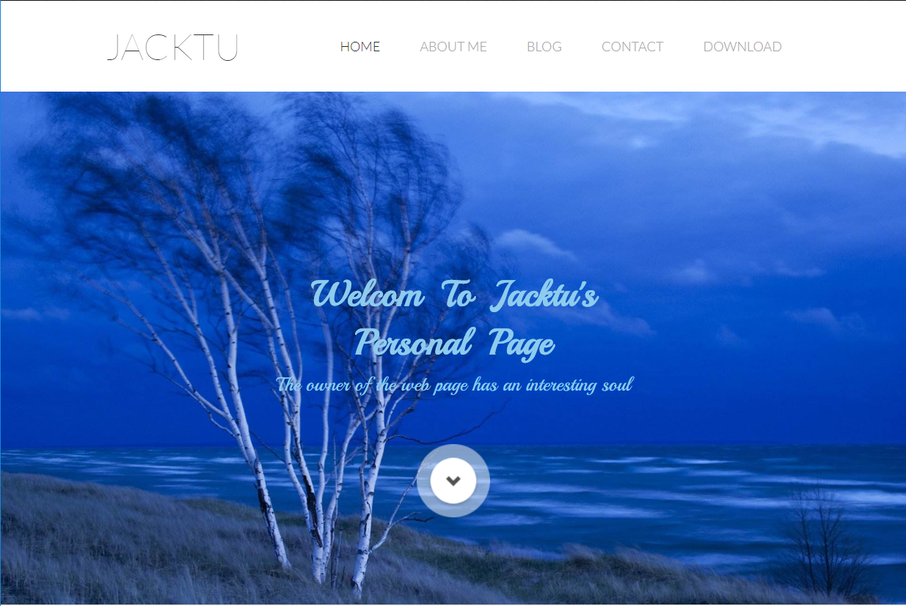
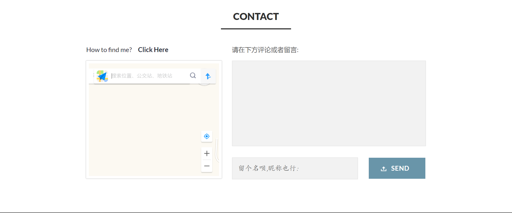
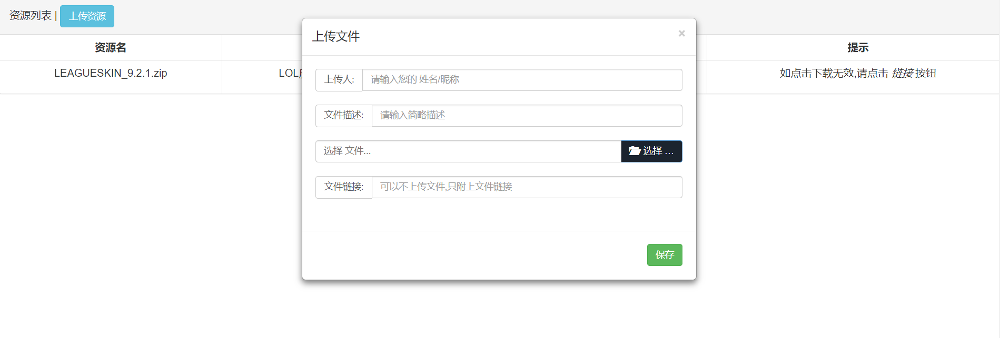

# JacktuPag / Jacktu's 个人主页

### [项目在线浏览](http://jacktu.top/jacktu)

## 前言
>搭了一个服务器,想放点自己的东西上去.于是就写了这个个人主页项目
 这是一个小项目,只有两个页面.不过麻雀虽小五脏俱全.
 前端到后端,bootstrap 到 ssm 框架 再到 MySQL 一样没少.
 起初这个项目只为练手,练习一整套的项目前端到后端的解决方案.
 到后来写的有点样子,于是就放到了服务器上面
 现在又写了一个 vue + spring boot 的个人主页项目
 所以之后这个项目会被取代

## 页面介绍
- index.jsp 主页

>有一些我的的个人介绍,有 find me / 留言,自动保存浏览者ip信息并获得归属地
 感兴趣可以[参考我的博客](https://blog.csdn.net/weixin_42144379/article/details/84900446)

- download/index.jsp 下载页面

>包含资源上传/资源下载功能,主要是挂些东西到这里,方便朋友下载

## 技术方面
- 前端使用 bootstarp 搭建页面,响应式并且美观
- 后端采用 ssm 三层框架,实现视图和逻辑分层降低耦合
- 数据采用 MySQL管理,相对轻量级 查询速度可以

## 环境
- java 8
- tomcat 8.5
- maven 3.5.4
- MySQL 5.7
- windows 10

## 项目启动
- 在 JacktuPage\src\main\resources\db.properties 中修改数据库连接信息
- 把 JacktuPage\readme\data.sql 导入到对应库中
>这是一个maven项目,导入到 eclipse 或者 idea 中使用tomcat(建议 tomcat 8以上)启动
 然后输入项目路径访问

## 截图
### 页面顶部

### 页面底部

### 资源下载页面

